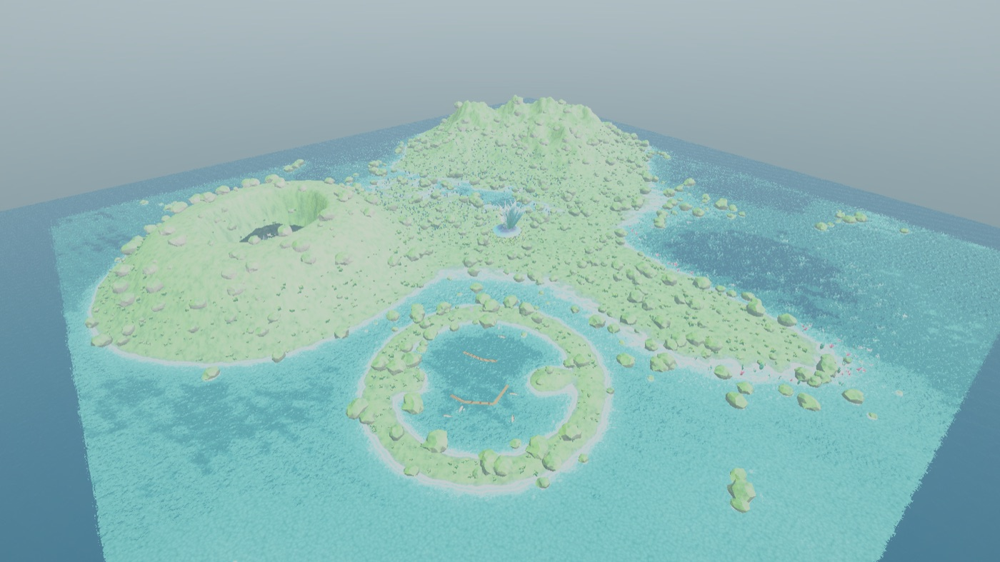
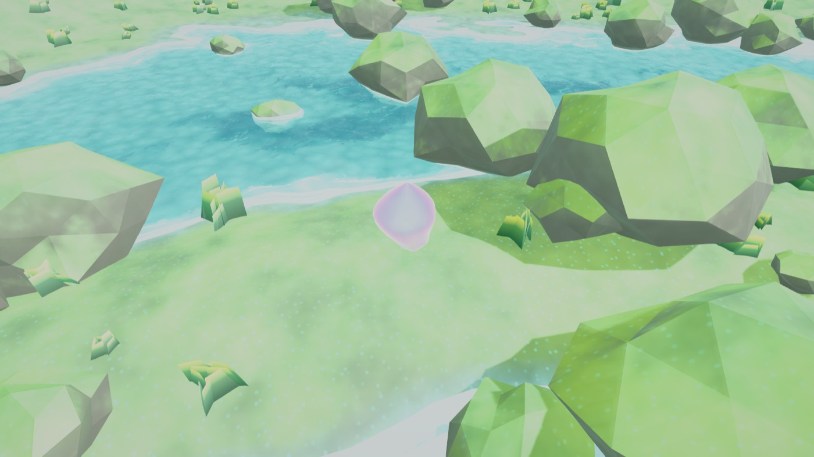

# Unity CLI Skills

A Claude Code plugin that teaches Claude to drive **Unity** from the terminal and
from AI agents — via the official [`unity` CLI](https://unity.com/blog/meet-the-unity-cli)
(Unity Hub CLI) and the experimental `com.unity.pipeline` package.

This repo is both a **plugin marketplace** and the **plugin** itself.

## Built without touching the Editor UI

Everything below was authored by driving a live Unity Editor from the terminal with
these skills — shaders, procedural meshes, scene assembly, lighting, play mode and
the screenshots themselves (`screenshot`, `eval`, `menu` over the Pipeline API).

**Scene view — one world holding six biomes**



A single 760 m archipelago: stilt village lagoon, cave massif, reef shallows,
bioluminescent swamp, ridged highlands and floating sky isles. The terrain is one
blended heightfield; palette zones cross-fade fog and ambient as the viewer moves.

**Game view — isometric character rig**



A hovering spirit with camera-relative movement under a damped isometric follow rig,
placed and verified over the Pipeline API.

**Game view — a night biome from the same shader library**


The same materials re-tuned by palette alone: aurora sky, emissive flora and
translucent canopies.

## What's inside — 4 skills

| Skill | Use it for |
|-------|------------|
| **unity-cli** | Manage Unity from the terminal: install/switch editors & modules, create/open/register projects, browse templates, licensing, auth, Unity Cloud, diagnostics (`doctor`/`env`/`status`). Includes a full per-command reference. |
| **unity-build-test** | Headless `build` / `test` / `run` for CI and local automation — the required `--target`/`--execute-method` pattern, Android signing, versioning, and CI recipes. |
| **unity-editor-automation** | Connect to a **live Editor**: install the Pipeline package, run `unity command` / `eval`, configure Unity as an **MCP server**, and the direct `/api/*` HTTP fallback. Documents the **`--proxy-disable` fix** for the loopback-vs-proxy hang and domain-reload token rotation. |
| **unity-editor-tasks** | **Solve concrete tasks** in a live Editor via the ~140 Pipeline commands + `eval` C#: build scenes, spawn/edit GameObjects, components, prefabs, scripts, play mode, tests, screenshots. Task-grouped catalog with real arg schemas + an `eval` cookbook. |

## Install

```bash
# 1. add this repo as a marketplace
/plugin marketplace add alexcmd/unity-cli-skills

# 2. install the plugin
/plugin install unity-cli-skills@unity-cli-skills
```

Or declare it non-interactively in `.claude/settings.json`:

```json
{
  "extraKnownMarketplaces": {
    "unity-cli-skills": {
      "source": { "source": "github", "repo": "alexcmd/unity-cli-skills" }
    }
  },
  "enabledPlugins": {
    "unity-cli-skills@unity-cli-skills": true
  }
}
```

Skills are auto-discovered from `skills/`; each becomes `/unity-cli-skills:<skill-name>`.

## Requirements

- The `unity` CLI on `PATH` (`curl -fsSL https://public-cdn.cloud.unity3d.com/hub/prod/cli/install.sh | UNITY_CLI_CHANNEL=beta bash`).
- For live-Editor automation: the `com.unity.pipeline` package installed in the project (`unity pipeline install`) and Unity 6.0 LTS+.

## Notes from real use

- On a machine with an OS/PAC **proxy**, live-Editor CLI commands hang unless you pass **`--proxy-disable`** (the CLI routes the loopback request through the proxy). This is baked into the skills.
- Entering/exiting **Play mode** and any **recompile** trigger a domain reload that restarts the Pipeline server and **rotates its auth token** — the skills cover reconnecting and re-reading the descriptor.

## License

MIT © Alex Priakhin
